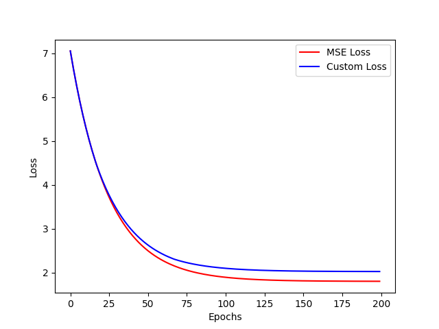
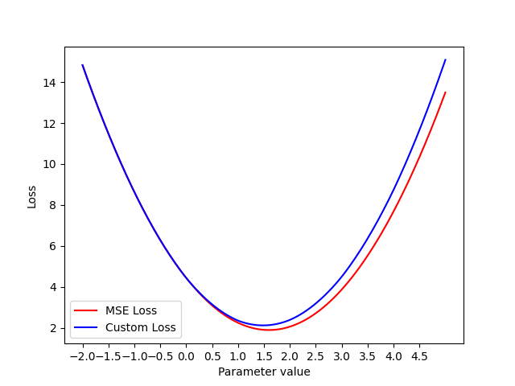

# Custom loss function for sales forecasting

This code trains a simple model for sales forecasting, and implements a customized loss function for the task at hand. It also outputs plots that help gain more insights about the problem and the model's performance (locaed in the `plots` folder).

## Instructions to run the code
* `make install` to fetch the needed parameters
* `python3 custom_loss.py`

Moreover, you can run the following options:
* `make format` to format the python files with black
* `make lint` for linting with pylint
* `make test` for an example of testing with pytest

## Task explanation and execution

In the given data, `stocks` is an upper limit for the `sales` on a certain time range. This means that even if the `demand` is higher than the stock, the retailer can only sell what they have in stock, not more. Therefore, it seems important to make sure that the model favors predictions that are below or equal to the available stocks.

### Customized loss function
We start from a common loss function for regression task, i.e. the Mean Squared Error (MSE), and add a penalty term to it under certain conditions. If the predicted outcome is:
+ below or equal to the available stocks, the penalty term is 0;
+ above the available stocks, the penalty term is given by: &lambda; &lowast; `(predictions - stocks)`
The term &lambda; is the strength of the penalty term, and is set to 1 in this example. However, more suitable values of &lambda; can be found using cross-validation.\
The goal of this implementation is to penalize predictions that exceed the available stocks, encouraging the model to favor predictions that better align with the retailer's stock availability.\
The code in this repository explores two different scenarios: one uses the MSE as loss function, and the other one the customized loss function.

### Explanation of findings
The behavior of the two loss functions across the epochs is slightly different: the custom one plateaus at a higher value than the MSE:\
\
This is expected: the penalty term is always positive, making the loss larger than in the case without penalty. This translates into an increase of the bias for the model with the custom loss function. However, in return, we expect to obtain more robust predictions because of the extra information that the custom loss function now entails.\
In order to evaluate the performance of the two models, the initial dataset is split into a training and a testing dataset, (80% and 20% the size of the original dataset, respectively). The models are trained on the training dataset, and their performance is evaluated on the testing dataset:
* Error from custom loss for model trained with MSE: 2.139
* Error from custom loss for model trained with custom loss: 2.127\
The accuracy on the model with the custom loss function is found to be slightly better than the one with the MSE, as expected.

Given that the model only contains one parameter, one can also plot the two losses as a function of the parameter:\
\
The parameter for which the function reaches its minimum is, as expected, the parameter of the trained model (1.590 and 1.496 for the model trained with MSE and with the custom loss, respectively).

### Conclusions
All above interpretations are based on a very simple model that contains one single parameter and a set of simple data. Since all samples have the same predictions because of the model definition, more accurate conclusions can be drawn from using a "realistic" model, such as a feed-forward fully-connected deep neural network, which would allow more wiggle room to tweak the custom loss function and, in general, to better evaluate the accuracy of the models.

